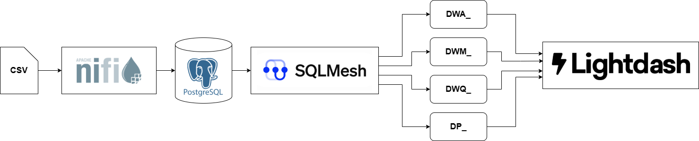

# Proyecto DWA con SQLMesh, PostgreSQL, NiFi y Lightdash

## 📌 Descripción General
Este proyecto implementa una solución completa de Data Warehouse Automation (DWA) solicitado en [MCD 2025 IDW - TPG01 Flujo DWA-1e](docs/MCD_2025_IDW-TPG01_Flujo_DWA-1e.md), utilizando solo herramientas **open source**. 

### 🛠 Herramientas utilizadas
- **Apache NiFi**: Ingesta y carga de archivos CSV
- **PostgreSQL**: Base de datos para staging y almacén de datos
- **SQLMesh**: Transformaciones, linaje, entornos y visualización de DAG
- **Lightdash**: Dashboards BI sobre las vistas generadas
- **DBGate**: Interfaz web para consultar la base de datos

## 🔄 Flujo de Datos
Detalle de flujo en [docs/DATAFLOW.md](docs/DATAFLOW.md).



## 🧱 Estructura de Capas
- `TMP_`: staging crudo cargado por NiFi
- `DWA_`: datos limpios, transformados y normalizados
- `DWM_`: memoria histórica utilizando SCD Tipo 2 para conservar cambios en el tiempo
- `DQM_`: métricas de calidad de datos (valores faltantes, duplicados)
- `DP_`: vistas de producto para dashboards (ventas, resumen por país, etc.)
- `MET_`: modelo de metadatos para trazabilidad y gobierno del DWA

## 📊 Visualización y Gestión

### SQLMesh UI
Accedé a SQLMesh en: [http://localhost:8084](http://localhost:8084)
- Visualizá el DAG de transformaciones
- Editá modelos `.sql` directamente
- Aplicá cambios por ambiente (`dev`, `prod`, etc.)

### Lightdash
Visualizá los dashboards BI en: [http://localhost:8081](http://localhost:8081)

### DBGate
Explorá las tablas y consultas en: [http://localhost:8082](http://localhost:8082)

### NiFi
Carga visual de archivos CSV en: [http://localhost:8080](http://localhost:8080)

---

## 🚀 Cómo ejecutar

```bash
docker compose up -d
```

Luego accedé a cada herramienta por los puertos indicados arriba.

Para compilar y aplicar los modelos en SQLMesh desde consola:

```bash
docker exec -it elt_sqlmesh bash
sqlmesh plan
sqlmesh apply
```

> También podés hacerlo desde la UI en http://localhost:8084

Paso a paso en [docs/PLAYBOOK.md](docs/PLAYBOOK.md)

---

## 🧩 Estructura del proyecto
Detalle de estructura en [docs/STRUCT.md](docs/STRUCT.md).

```bash
elt-dwa/
├── sqlmesh_project.toml            # Configuración del proyecto SQLMesh
├── models/
│   ├── tmp/                        # Modelos de staging
│   ├── dwa/                        # Transformaciones limpias
│   ├── dwm/                        # Memoria histórica con SCD tipo 2
│   ├── dqm/                        # Calidad de datos
│   ├── dp/                         # Producto de datos (dashboards)
│   └── met/                        # Gestión de metadatos y trazabilidad
├── docs/                           # Documentación detallada
├── data/
│   ├── ingesta1/                   # CSV carga inicial
│   └── ingesta2/                   # CSV carga novedades
├── docker-compose.yml              # Orquestación de servicios
└── README.md
```

---

## 🧠 Sobre las tablas `MET_`

El modelo `MET_` permite capturar y mantener:
- Estructura y propiedades de todos los modelos (`met_model_registry`)
- Dependencias entre ellos (`met_model_dependencies`)
- Metadatos de columnas (`met_model_columns`)
- Historial de versiones (SCD2) con `met_model_registry_hist`

Estas tablas son utilizadas para generar catálogos, trazabilidad, y seguimiento de cambios en el pipeline de datos.

---

## Autores

- [CANCELAS, Martín](https://www.linkedin.com/in/mart%C3%ADn-cancelas-2313a1154/)
- [NICOLAU, Jorge](https://jorgenicolau.ar/)
- [VERDEJO, Manuel](https://www.linkedin.com/in/manuel-nicol%C3%A1s-verdejo-b19255126/)

**Introduccíon a Data Warehousing - 2025**

---
