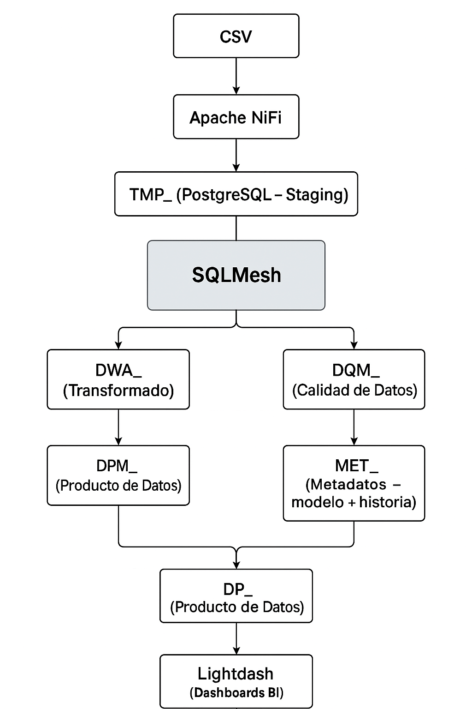

# 📊 Diagrama de Flujo de Datos - Arquitectura DWA

Este documento representa visualmente el flujo de datos a lo largo del sistema de automatización de Data Warehouse (DWA) implementado con SQLMesh, PostgreSQL, NiFi y Lightdash.

---

## 📈 Flujo General

---

## 🧱 Capas del Modelo

- **TMP_**: staging de datos crudos extraídos por NiFi desde archivos CSV
- **DWA_**: transformación y normalización (limpieza, joins, cast)
- **DWM_**: historial completo de cambios (SCD Tipo 2)
- **DQM_**: monitoreo de calidad, nulls, duplicados, trazabilidad
- **MET_**: metadata del sistema, dependencias y versión histórica
- **DP_**: vistas de negocio listas para ser usadas en dashboards y exploraciones

---

## 🛠 Herramientas utilizadas

| Herramienta    | Rol Principal                        |
|----------------|--------------------------------------|
| Apache NiFi    | Ingesta de archivos CSV              |
| PostgreSQL     | Almacenamiento de staging y modelos  |
| SQLMesh        | Transformación, DAG, control de entornos |
| Lightdash      | Visualización y dashboards BI        |
| DBGate         | Consulta manual y verificación       |

---

> Este flujo garantiza trazabilidad, calidad y control completo del ciclo de vida de los datos, desde su ingesta hasta su análisis.
